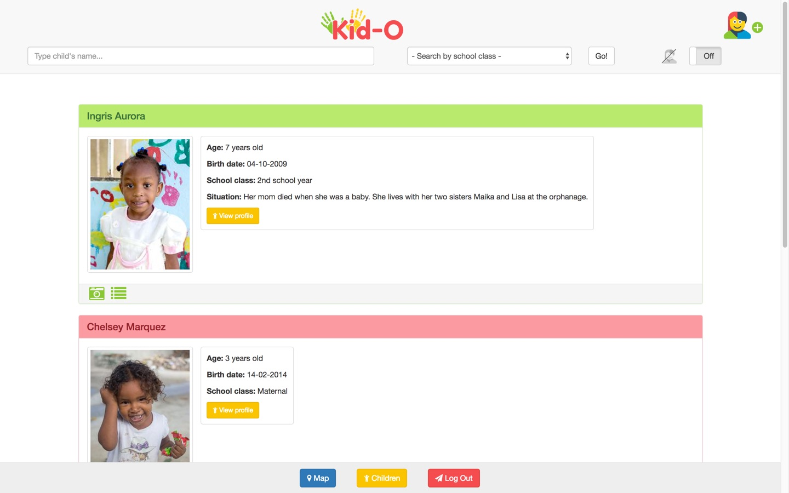
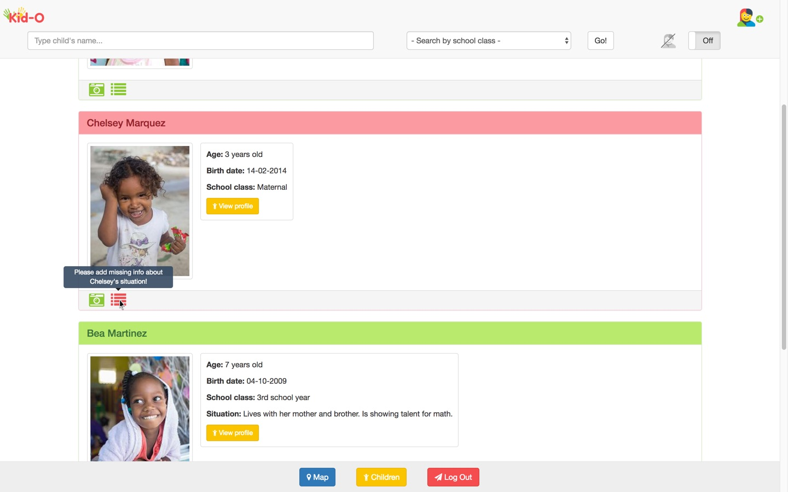
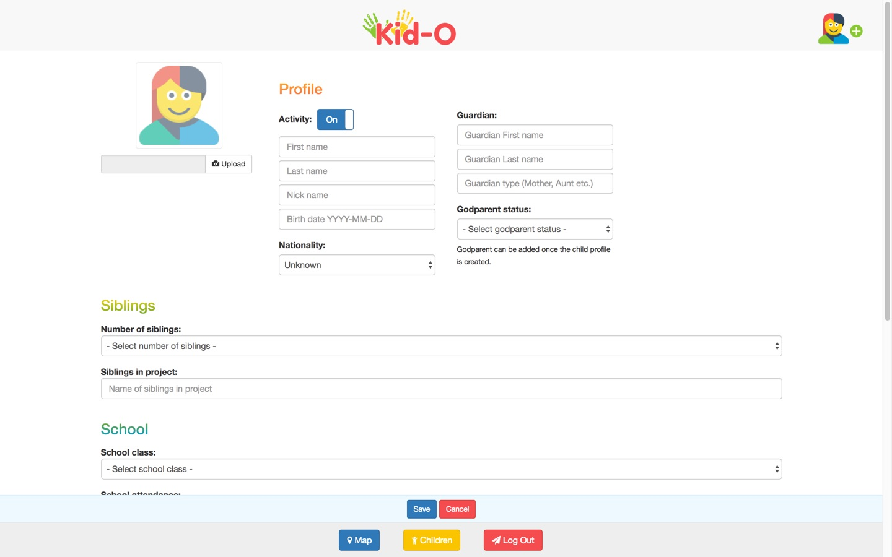
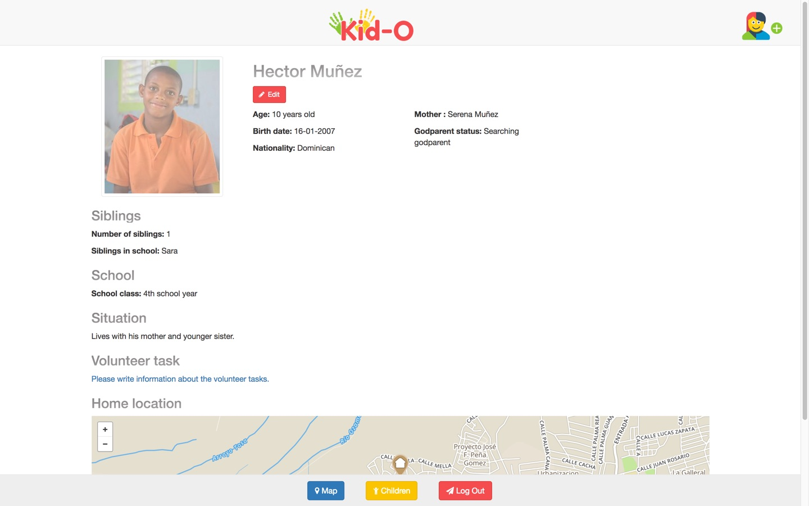
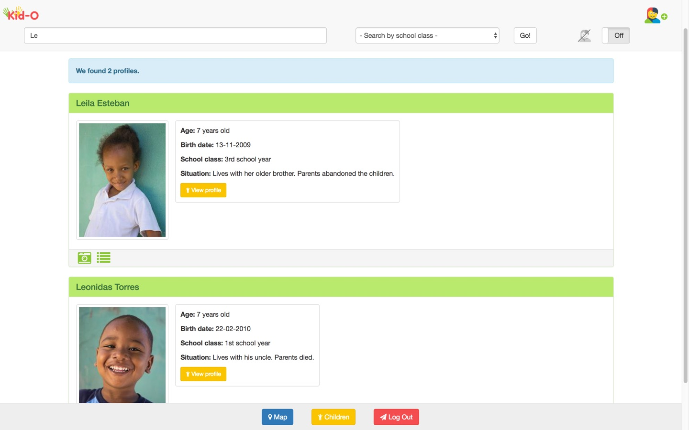
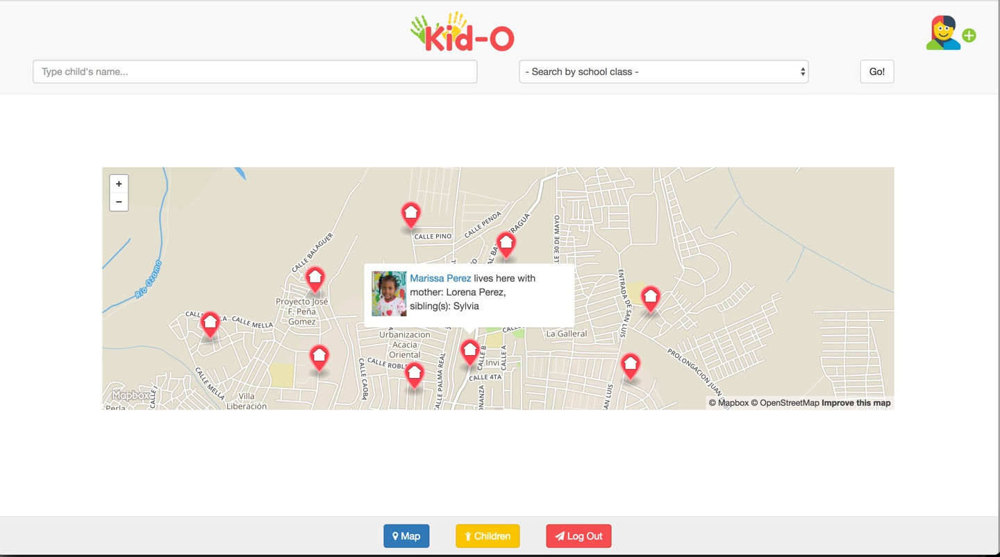

# Kid-O

Kid-O helps Non-Profit children’s aid orgs keep an overview of their children.

##### Google Impact Challenge 2018 award winner

##### Winner of C-Base Hack 'N Tell HACK OF THE MONTH PRIZE

### Contents

- [Overview](#overview)
- [Technologies & Stack](#technologies-and-stack)
- [Features](#features)
	- [In-depth use cases](#in-depth-use-cases)
- [Future plans](#future-plans)
- [Technical choices](#technical-choices)
- [Screenshots](#screenshots)
- [Contributing](#forking)

## Overview

Kid-O solves these common problems for aid workers:
* keeping accurate and up-to-date information about each child in a central sharable CMS
* managing child profiles without internet access (via SMS)
* structures a child's information in an easily editable format
* organizes information such as name, age, home situation, school year etc.
* makes it easy to visualize a child's home location on a map even when no address is available
* makes it easy to add the orresponding godparent to the child profile, if available

Kid-O will be tested by the children's aid project [Dominiño](http://www.dominino.de) in the Dominican Republic.

## Technologies & Stack

#### Backend
Python, Flask, SQLAlchemy, PostgreSQL

Flask extensions: Flask-Login, Flask-Bcrypt, Flask-WTForms, Flask-SQLAlchemy, Flask-Seasurf.

Testing: unittest.

#### Frontend:
JavaScript, jQuery, AJAX, Jinja2.
HTML5, CSS3, Twitter Bootstrap (html/css/js framework), RWD (responsive web design).

#### APIs:
Mapbox.js(OpenStreetMaps), Twilio.

## Features

- [x] Shows children's profiles

- [x] Previews, compresses and uploads images

- [x] Saves new or updated home location data from the map into the database and shows it on the map.

- [x] Flask app routes requests to the database and manages form validation via Flask-WTForms.

- [x] Enables search by first-, last-, both names, part of the name or school year.

##### Security with Bcrypt and Flask-Login
- [x] Encrypt and verify user passwords using hashes.

- [x] Secure user sessions let users stay logged in.

##### APIs
- [x] Twilio API integration allows users to create new child profiles through a text message, including the photo of the child(through MMS). No internet is required.
- [x] Mapbox.js allows users to save home location by clicking the location on the map rather than having to type in an address.

##### Data visualization and interaction
- [x] Shows what information is missing from the child's profile in the overview page.

- [x] Requests missing information in the child's profile.

- [x] Child's home location shown and editable on a map.

- [x] Child's age is calculated from their birth date.

- [x] Users can preview the image that will be uploaded to the child's profile.

- [x] Custom responsive web design (RWD) using CSS3.

### In-depth use cases

#### Overview page
- List's a short preview of the children's profiles
- Icons are displayed in green or red depending on what information in the child's profile is filled out or if there is information missing
- The heading title bar displays in green or red depending on available information
- The search function can search for any part of the child's name and stays fixed to the top side of the page for accessibility
- The "add child" button on the top right of the page makes it easy to add a new child to Kid-O
- Bottom navigation stays fixed for easier accessibility

#### Child page
- Shows the child's information in a structured, editable format
- When adding or editing a child's profile, the selected photo of the child is displayed as a preview on the page.
- If a photo of the child is missing, Kid-O displays a standard image.
- If information is missing, Kid-O displays requests to fill out the missing info on the profile pages.
- Child's age is calculated from their birth date.

#### Users can:
- Sign in/sign out/sign up (create an account)
- Add a child profile to Kid-O. They can add basic information such as name, birth date, the child's guardian name, home situation etc.
- Edit a child's profile
- Add the child's home location on a map
- Update the child's home location
- Search for a child on the search form at the top of the page
- Add a child's profile through SMS/MMS including the child's photo

## Future plans 

##### Verify existence of child when creating a new profile
Currently, the existence of the child been added to Kid-O is not verified. I plan to warn the user with a popup suggesting a possible child if the new child's name is similar to an existing child in the system.

##### Upload child photos to Amazon S3
For demo purposes, I save the photos of the children on my hard disk. I plan to upload them to Amazon S3.

##### Lazy Load
In order to limit the use of data, I want to include a Lazy Load to only preview a certain amount of children's profiles at a time.

##### Alerts for upcoming appointments/due updates
I plan to use the Twilio API to send a text message/email to the aid workers when a child's profile has not been updated for a specific amount of months.

##### Additional security
To prevent brute-force hacking attempts, I will add an increasing time delay after multiple failed login attempts.

##### Monitor which user edited which child's profile
Allow users to see their stats on their user profile pages, e.g. how many updates they have made, which child profile they last worked on, etc.

##### Real time updates
Currently, the page must be refreshed to show updated children's profiles. This should be updated to happen in real-time with server-sent events.

##### Add messaging system
Many children's aid projects have godparents who sponsor children. I want to add a messaging system that makes it easier for the volunteers to send up-to-date information about the children to their godparents.

## Technical choices 

##### Security
In any login system, security is important. I wanted to ensure that user passwords couldn't be stolen, especially considering that most people re-use their passwords all over the place (despite warnings against such a practice). Bcrypt offers a simple but effective encryption and verification system using hashes, requiring only a few lines of code.

I chose Flask-Login to manage secure user sessions when they login. This Flask extension is well-known, well-documented, reliable, and offers exactly what I needed to implement that feature.

##### PostgreSQL
I chose to use PostgreSQL to make use of the powerful SQLAlchemy ORM and ensure scalability.

##### Flask-WTForms
Partway through the project, I discovered Flask-WTForms, a Flask extension that offers form creation and validation. I switched to this method for all future forms on the site because of its simple and effective form management and validation options.

##### OpenStreetMaps
My app will be deployed for the Non-Profit  Dominiño in the Dominican Republic. For this reason, I decided to use OpenStreetMaps instead of Google Maps, since OpenStreetMaps offers much better coverage of the infrastructure in the Dominican Republic than Google Maps.

##### Custom CSS
Using CSS3, I customized the checkboxes and select dropdowns.  I didn't like their default appearances, and wanted to change their colors and styles to better match that of the website.

I used Bootstrap for certain things, like button shapes and the navbar.

##### JQuery
I used JQuery to dynamically shrink the navbar header on scroll by adding a CSS class to the nav element. I also used JQuery to allow the user to drop a pin on the home location of the child in the map.

##### Code structure

All my routes are in one file, views.py, and my database models are in a separate models.py file. I dabbled with child base views in child.py.
The Twilio API-related route is at the bottom of views.py.

On the overview page, I used Jinja to show alerting icons depending on what information is missing in the children's profile.
The users are also asked to fill out missing information in the child's profile page.
On the frontend, rather than recode my nav bar for every web page, I used Jinja templates to simplify the process by extending from a base.html file that contains the nav bar.

## Screenshots 

###### Overview of the children

###### Display of missing information on the child profile preview

###### Child profile

###### Add child profile

###### Edit child profile

###### Deactivate child profile

###### Show hidden child profiles in overview

###### Delete child profile

###### Add and delete godparents to child profile

###### Search function
Search by name:

Search by school class:

###### Map

###### Login

###### Signup with form validation

## Want to contribute?

1. You'll need your own API keys for Twilio!
2. Install Postgres
	> For Mac users, you can install Postgres.app and PSequel for creating connecting to postgres superuser, create
	database user & password and actual database through a GUI interface. Here is a medium post
	in how you can create a [user and database through command line](https://medium.com/coding-blocks/creating-user-database-and-adding-access-on-postgresql-8bfcd2f4a91e)

    1. Create a Postgres user kido with password kido.
	2. Create a Postgres database kido with owner kido.

3. Fork [github project](https://github.com/vanesa/kid-o)
    > Run the following commands
    1. `git clone git@github.com:<GITHUB USERNAME>/kid-o.git`
    1. `cd kid-o`
    2. ``virtualenv --no-site-packages -p `which python3` venv``
    3. `source ./venv/bin/activate`
    4. `pip install -r requirements-frozen.txt`
    5. `python setup_database.py`
    5. `npm install -g less`
    5. `bash ./run.sh`
    6. Go to http://localhost:5000 in your browser to use the app
